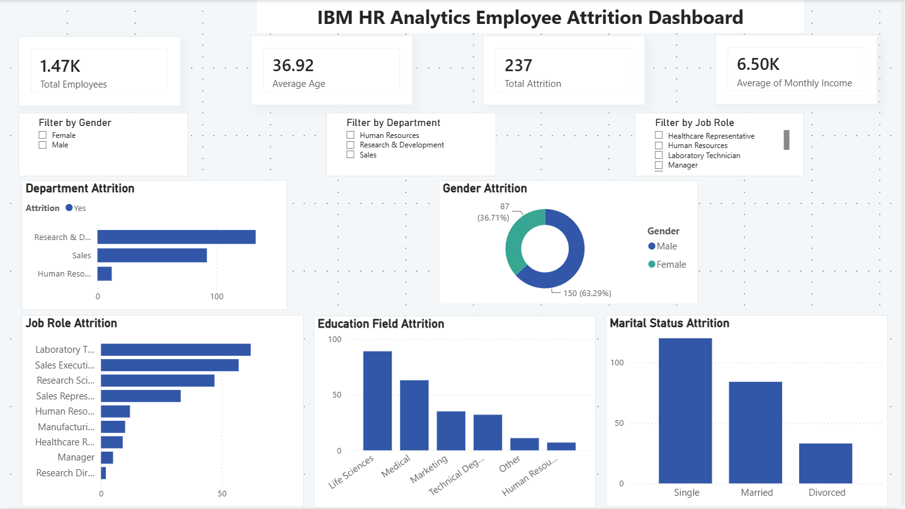

# IBM HR Analytics Employee Attrition Dashboard

## Dashboard Preview

## Project Overview

Developed an interactive HR Analytics Dashboard using Power BI to analyze employee attrition, workforce demographics, and organizational trends.

## Tools Used

- Power BI
- DAX
- Excel

## Key Features

- Employee Attrition Analysis
- Department-wise Analysis
- Gender-wise Analysis
- Education Field Analysis
- Marital Status Analysis
- Interactive Slicers and Filters
- KPI Cards and Data Visualization

## KPIs

- Total Employees
- Average Age
- Total Attrition
- Average Monthly Income

## Key Insights

- Research & Development department experienced the highest attrition.
- Single employees showed higher attrition rates.
- Male employees had higher attrition compared to female employees.
- Life Sciences employees recorded the highest attrition.

## Files Included

- IBM_HR_Analytics_Employee_Attrition_Dashboard.pbix
- WA_Fn-UseC_-HR-Employee-Attrition.csv
- HR_Analytics_Dashboard.png
